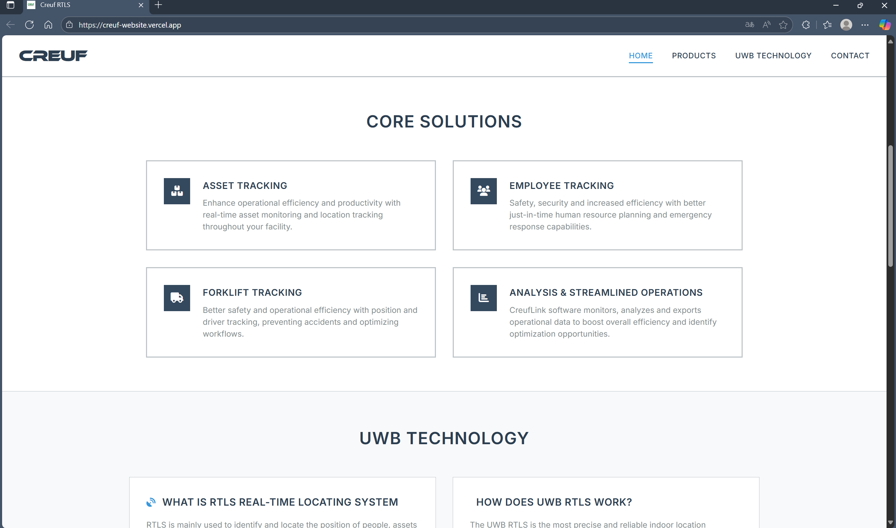
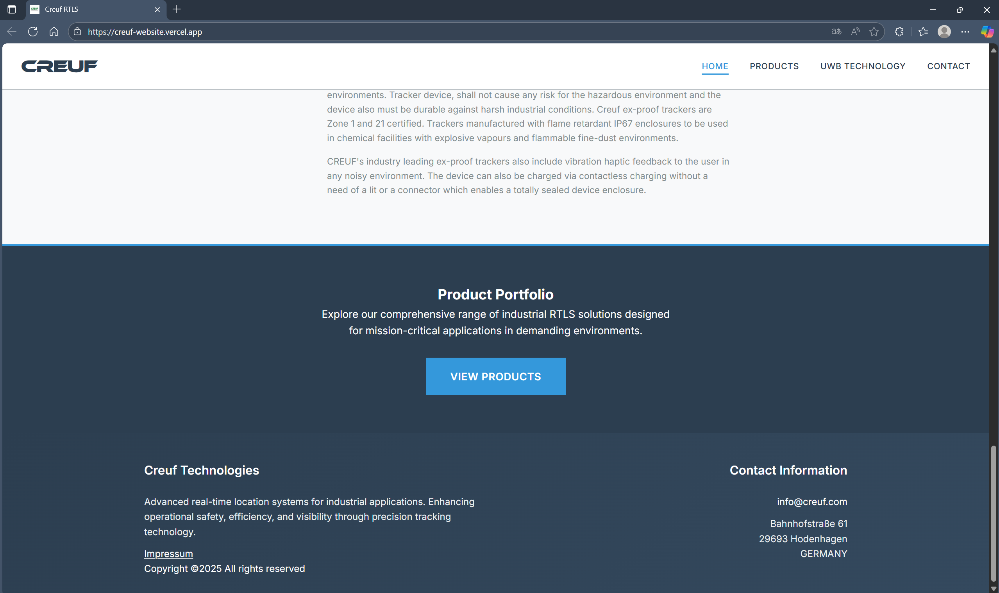
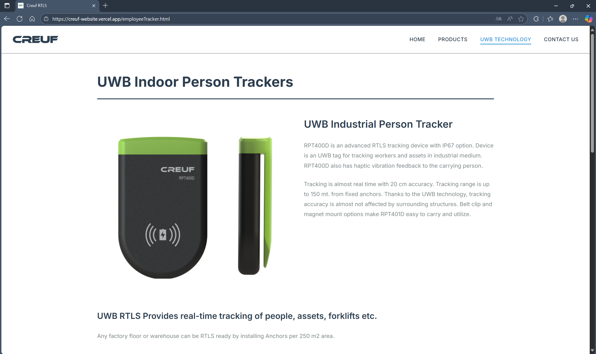
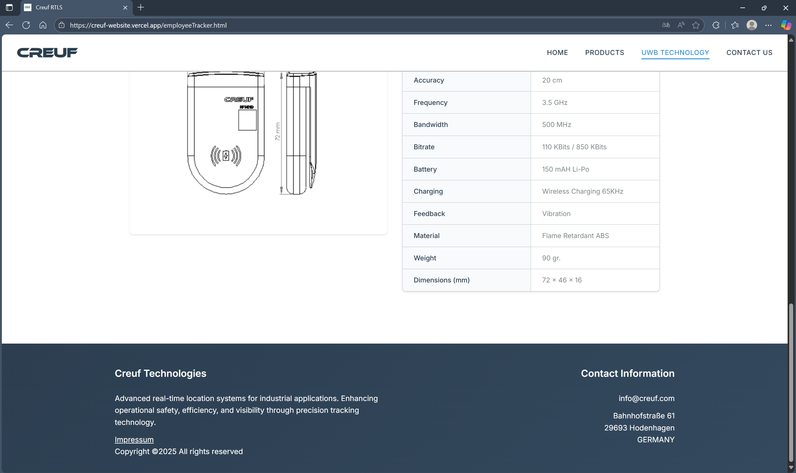
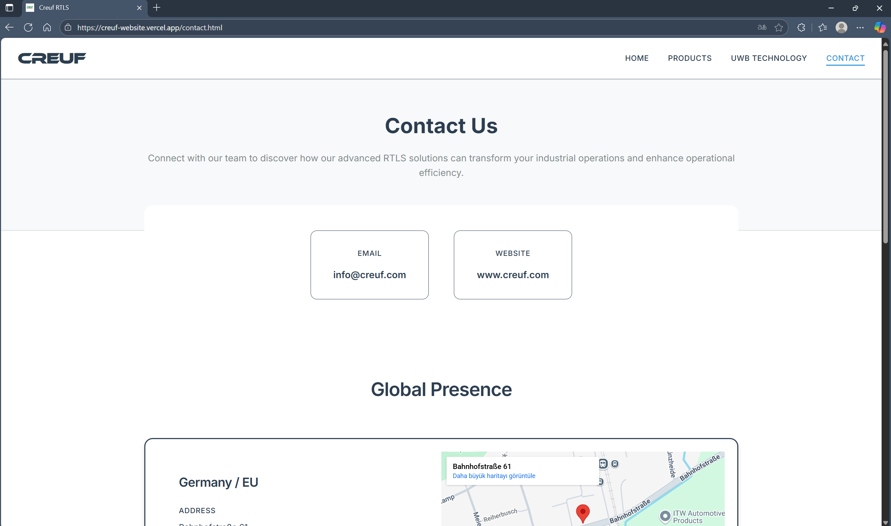
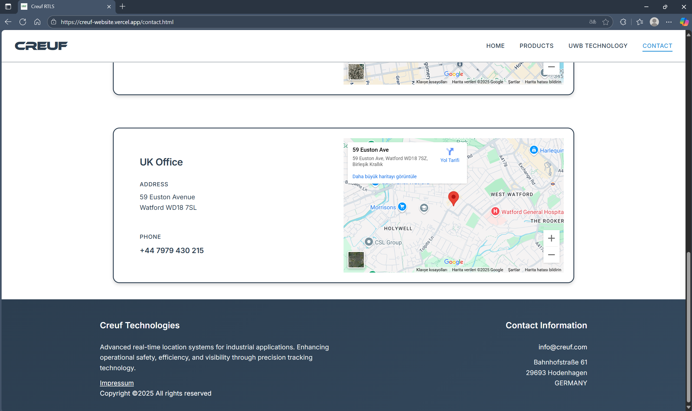

# Cruef Web Sitesi

## Projeye Genel Bakış

Endüstriyel alanda ürün tasarımı ve üretimi yapan bir şirket için HTML-CSS ile tasarlanmış statik bir web sitesidir.

## Kullanılan Teknolojiler

### Front-end Framework

- HTML-CSS

### Stil ve Tasarım

- HTML - CSSS
- Maps'ten vei çeklilen kısımda google maps'ten alınan URL

### Site Canlı Yayın Linki
creuf-website.vercel.app

## Fotoğraflar

### Home Page

### Products

### Contact Us

